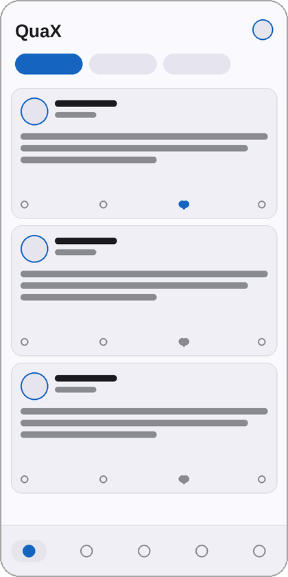
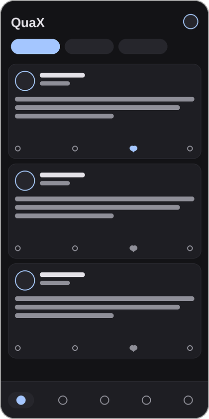
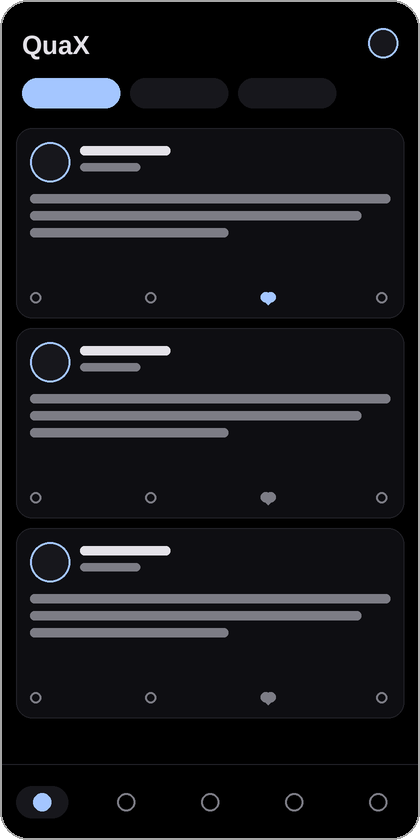
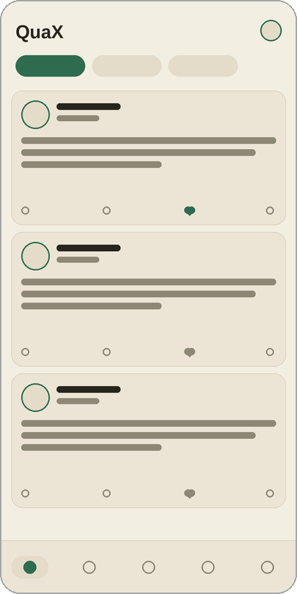
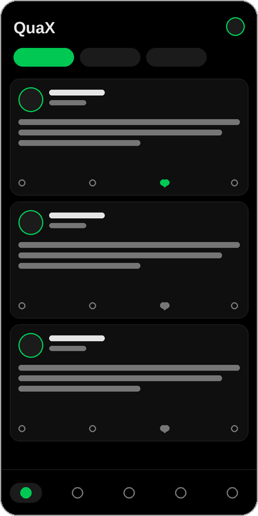

<div align="center">


# QuaX-fix

[](https://github.com/Teskann/QuaX)
[](/LICENSE)
[](https://github.com/Aimdi/QuaX-fix/actions)


**QuaX-fix** is a personal fork of [QuaX](https://github.com/Teskann/QuaX), the free, open-source,
privacy-focused client for X (formerly Twitter) — itself forked from
[Quacker](https://github.com/TheHCJ/Quacker) and [Fritter](https://github.com/jonjomckay/fritter).

</div>

## ⚠️ This is a vibe-coded fork

This fork is **vibe coded**: virtually every change on top of upstream QuaX was written by an AI
coding agent (Claude), directed and tested by a human, but not line-by-line reviewed the way
upstream code is. It exists to scratch personal itches and to experiment quickly.

What that means for you:

- Expect rougher edges than upstream. Features land fast and are validated by using the app, not
  by a formal review process.
- If you want the stable, carefully maintained experience, use the original
  [Teskann/QuaX](https://github.com/Teskann/QuaX) — all credit for the app itself belongs there.
- Issues in this repo are welcome, but fixes will also be vibe coded.

> [!IMPORTANT]
> An X account is needed to use QuaX. Subscriptions, saved posts, and all other settings are
> independent from the account you're logged into. Everything is local to the app.

## Major differences from [Teskann/QuaX](https://github.com/Teskann/QuaX)

This fork is based on upstream **v4.12.0**. Everything below is on top of that.

### Feeds & groups

- **Media-only view for group feeds** — a toggle in the group toolbar filters a feed down to posts
  with photos, videos, and GIFs, rendered as a media grid instead of tweet cards.
- **Media grid layouts** — choose between masonry, a full-width media feed, or a roomy two-per-row
  layout (`Settings > Media`), shared by every media grid in the app.
- **Feed order per group** — *Recent* (by date) or *Popular* (the same recent window reordered by
  likes), switchable instantly.
- **Custom content filter per group** — a three-position content bar (SFW only / default / NSFW
  only) based on X's sensitive-content flag, on a dedicated settings screen.
- **Feed gap filling** — after a long absence, the feed keeps paging until it reconnects with the
  posts it already has, instead of leaving a permanent hole (upstream issue #27).
- **Tweet deduplication in group feeds** — the same post no longer appears multiple times when
  pages and cached chunks overlap.
- **Zen mode** — an anti-doomscrolling mode: engagement counts are hidden, replies stay hidden
  until you ask for them, and feeds are strictly newest-first with a per-author cap.

### Search & posts

- **Advanced search form** — a full-screen form mirroring `x.com/search-advanced`: exact words,
  hashtags, from/to/mentioning accounts, minimum engagement, media-only, and date ranges.
- **Quotes screen** — tap the repost counter on a post to see the posts quoting it (the counter
  turns green when quotes exist).
- **Community Notes in timelines** — feed searches now request notes, so noted posts show their
  note in feeds, not only in the detail view.
- **Subscribe from the timeline** — a small **+** badge on avatars of authors you don't follow
  yet lets you subscribe (and file them into groups) on the spot; can be turned off.
- **Conversation translate** — long-press the translate button to translate a post together with
  all its loaded replies.
- **Quick image download** — long-press a photo in the timeline to download it directly.

### Subscriptions & saved posts

- **Broken-subscription cleanup** — a scan finds deleted/suspended accounts among your
  subscriptions and removes them after confirmation; renamed accounts are silently repaired.
- **Broken-bookmark cleanup** — the same kind of scan for saved posts, across all folders.
- **Per-user "hide reposts"** — a feed filter on profiles, mirroring X's "turn off reposts",
  applied across every group and the combined feed.
- **Saved media view** — the bookmarks screen gets the same media-only grid toggle, per folder.
- **Subscriptions screen polish** — draggable scrollbar, group members listed first in the group
  edit dialog.

### Privacy & hardening

- **Backups disabled** (`android:allowBackup=false`) so the database holding X session tokens can
  never be extracted through adb or cloud backups.
- **Removed a leftover debug log** that dumped parsed user profiles into the device log.

### Theming & identity

- **New app icon** — a bold geometric Q monogram on a blue gradient with a soft drop shadow,
  with a small serif *y* signature in the corner.
- **Two theme presets** — *Fairy Forest* and *Pitch Black* (see below).

### Build & release

- **CI works without upstream signing secrets** — fork builds fall back to debug signing, and APKs
  are uploaded as workflow artifacts.
- **Release workflow** — publishes the built APKs as GitHub release assets.

### Fixes

- Group edit dialog buttons no longer overflow off-screen (creating a group was impossible).
- Fixed a crash (`ProviderNotFoundException`) when opening a conversation.
- Fixed the media grid layout options and moved them to `Settings > Media`.
- Hidden the stray horizontal scrollbar over the tweet stats row.

> [!NOTE]
> A per-user new-post notification feature (background checks + local notifications) was also
> vibe coded, found unreliable, and removed again. Such is vibe life.

## Themes

QuaX-fix ships two hand-tuned theme presets on top of the regular light/dark/true-black theming
(`Settings > Theme`):

| Default · Light | Default · Dark | True Black | Fairy Forest 🧚 | Pitch Black 🌑 |
|:---:|:---:|:---:|:---:|:---:|
|  |  |  |  |  |
| Seed-color theming | Seed-color theming | Pure black dark mode | Warm paper cream with forest green accents | Pure black with a vivid green accent |

## Download

Grab the APK from this fork's [GitHub releases](https://github.com/Aimdi/QuaX-fix/releases), or add
the repo to [Obtainium](https://apps.obtainium.imranr.dev/redirect.html?r=obtainium://add/https://github.com/Aimdi/QuaX-fix).
Fork builds are **debug-signed** — they won't update over an installation of upstream QuaX (and
vice versa).

For upstream releases and APK signature verification, see
[Teskann/QuaX](https://github.com/Teskann/QuaX/releases).

## Build locally

Prerequisites:

- Python
- [FVM](https://fvm.app/) (Flutter Version Management)

The Flutter SDK version is pinned in [`.fvmrc`](./.fvmrc) and provisioned by FVM, so every build uses the exact same toolchain.

```bash
# Install the pinned Flutter SDK and activate it for this project
fvm install
fvm use

# Generate launcher icon assets
python -mvenv .venv
bash -c '
  source ./.venv/bin/activate
  pip install -r requirements.txt
  python generate_icons.py
'

# Run all build steps through fvm so the pinned SDK is used
fvm flutter pub get
fvm dart run flutter_launcher_icons
fvm dart run dart_pubspec_licenses:generate
fvm dart run intl_utils:generate
fvm dart run flutter_iconpicker:generate_packs --packs material
fvm flutter build apk --debug
```

## More information

- [FAQ (upstream)](./docs/QuaX.md)
- [LICENSE](./LICENSE)
- [Contributing](./CONTRIBUTING.md)
- [Changelog (upstream, up to v4.12.0)](./changelog.md)

## Credits

QuaX is made by [Teskann](https://github.com/Teskann), building on
[Quacker](https://github.com/TheHCJ/Quacker) and [Fritter](https://github.com/jonjomckay/fritter).
This fork only piles vibe-coded changes on top of their work.
